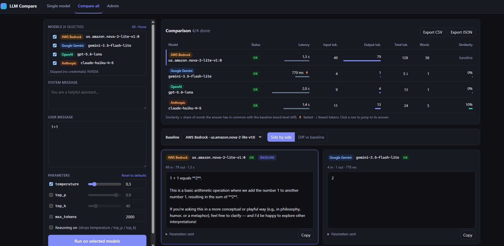
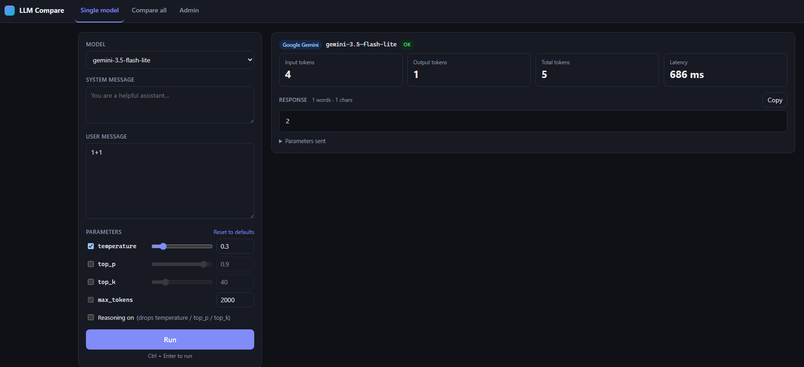
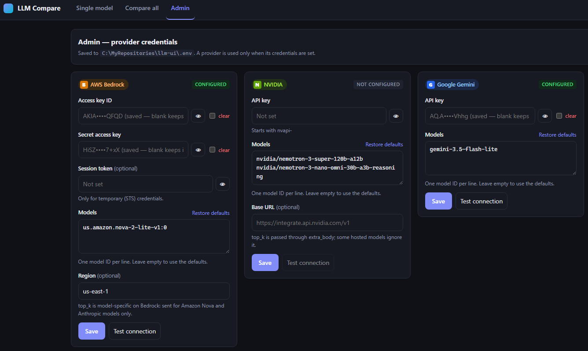

# LLM Compare

A small web UI for sending the same prompt to different LLMs and comparing the answers, token usage and latency.

- **Single model**: pick one model, set the system message, user message, `temperature`, `max_tokens`, `top_p` and `top_k`, then run it. You get the response, the input, output and total token counts, and the latency.
- **Compare all**: send the same request to every selected model that has credentials, all at once. The comparison table fills in as each model answers. It shows status, latency, tokens, word count and **similarity to a baseline**. Below the table you can view the answers side by side, or as a **word-level diff** against any baseline you pick. You can export the results as CSV or JSON.
- **Admin**: a password-protected page for API keys and models. It reads and writes the `.env` file. Keys are always shown masked. Each provider has a **Models** box (one model ID per line) that starts with default models, and you can replace them with your own.

Supported providers: **AWS Bedrock, NVIDIA, Google Gemini, OpenAI and Anthropic**. The provider code is adapted from Lesson 2's `06a-provider-gateway.py` / `06b-compare-providers.py`, and it uses the same `.env` variable names.

## Screenshots

**Compare all**: the same prompt sent to four models, with latency, tokens and similarity to the baseline, and the answers side by side.



**Single model**: one model's answer with its token counts and latency.



**Admin**: provider credentials (keys are masked) and a Models list per provider.



## Quick start (Windows)

```powershell
cd C:\MyRepositories\llm-ui
powershell -ExecutionPolicy Bypass -File .\run.ps1
```

Then open http://127.0.0.1:8000.

On first run the script creates `.venv`, installs `requirements.txt` and copies `.env.example` to `.env`. Then go to **Admin**, choose an admin password and fill in the keys.

Manual alternative:

```powershell
python -m venv .venv
.venv\Scripts\activate
pip install -r requirements.txt
uvicorn app.main:app --reload
```

### Reusing your Lesson 2 `.env`

You can copy the lesson's `.env` into this folder, since the variable names are the same. Or you can point the app at the lesson's file directly:

```powershell
$env:LLM_UI_ENV_FILE = "C:\DevOps-Experts\Lesson-2\...\code\.env"
.\run.ps1
```

## How it works

| Setting | Notes |
|---|---|
| A provider is **used** only when its credentials are set | Providers without credentials are listed as "skipped" |
| **Models**: one ID per line in Admin, stored comma-separated in `*_MODEL_ID` | Each model becomes a separate entry. If the variable is unset, the defaults below are used |
| `NVIDIA_FALLBACK_MODEL_ID` from the lesson `.env` is still read | It appears in the NVIDIA Models box. Saving that box merges it into `NVIDIA_MODEL_ID` |
| `.env` is re-read on every request | Changes made in Admin or by hand apply without a restart |

### Default models

| Provider | Default models |
|---|---|
| AWS Bedrock | `us.amazon.nova-2-lite-v1:0` |
| NVIDIA | `nvidia/nemotron-3-super-120b-a12b`, `nvidia/nemotron-3-nano-omni-30b-a3b-reasoning` |
| Google Gemini | `gemini-3.5-flash-lite` |
| OpenAI | `gpt-5.6-luna` |
| Anthropic | `claude-haiku-4-5` |

"Restore defaults" in Admin puts these back. The defaults are defined in `app/config.py`.

### Parameters

Each sampling knob has a default and an on/off switch, because several current models reject some of them:

| Parameter | Default | Sent by default | Notes |
|---|---|---|---|
| `temperature` | 0.3 | yes | |
| `top_p` | 0.9 | no | Some Claude models reject `temperature` and `top_p` together |
| `top_k` | 40 | no | Not available in the OpenAI API. On Bedrock it's only sent for Nova and Anthropic models |
| `max_tokens` | 2000 | always | Reasoning tokens come out of this budget |
| Reasoning | off | | When on, temperature, top_p and top_k are dropped, as in 06a |

Each result lists which parameters were **sent** and which were **skipped, and why**. That way a difference between two answers isn't hidden by a parameter one provider ignored.

Token counts are normalized. For Gemini, thinking tokens are added to the output tokens so the numbers are comparable, and reasoning tokens are shown separately when the API reports them.

### Comparison

- **Similarity** is `2 × shared words / (words A + words B)`, from a word-level LCS diff against the baseline. Very long answers fall back to a line-level diff.
- ⚡ marks the fastest model and ↓ marks the one with the fewest total tokens.
- A failing model (bad key, rate limit, retired model) shows its error and doesn't stop the others.

### Provider icons

Each provider pill shows a small icon in Compare all, Single model and Admin. To use official logos, put the files in `app/static/logos/`, named `bedrock`, `nvidia`, `gemini`, `openai` and `anthropic` (`.svg`, `.png`, `.webp`, `.jpg` or `.ico`), then reload the page. Without a file, a small lettered badge is shown instead.

### Anthropic keys and workspaces

Some Anthropic API keys aren't scoped to a single workspace, for example organization-level or personal keys. With those keys, every request fails with *"This API key is not scoped to a workspace … must include the anthropic-workspace-id header"*. To fix it, open **Admin → Anthropic → Workspace ID** and enter the workspace ID (`wrkspc_…`, **not** the word "Organization"). You'll find it in the ID column of Claude Console → Settings → Workspaces. If your organization only has the Default Workspace and no ID is shown for it, create a workspace there and use that workspace's ID. Admin rejects values that don't start with `wrkspc_`. The app then sends it as the `anthropic-workspace-id` header. Keys created inside a workspace don't need this.

## Project layout

```
app/
  main.py        FastAPI routes: /api/models, /api/generate, /api/admin/*
  providers.py   Provider gateway (Bedrock, NVIDIA, Gemini, OpenAI, Anthropic)
  config.py      Provider registry + .env read/write
  static/        index.html, app.js, diff.js, style.css (no build step)
  static/logos/  optional provider logo files (see its README)
docs/            base44-prompt.md, screenshots/
tests/           Offline tests: every SDK is faked
```

## Tests

```powershell
pip install -r requirements.txt
pytest -q
```

## Security notes

- The app binds to `127.0.0.1` only. Don't expose it on a network as it is.
- `ADMIN_PASSWORD` and all keys are stored in plain text in `.env`, just like the lesson setup. `.env` is git-ignored.
- Admin sessions live in memory, so restarting the server logs you out.
